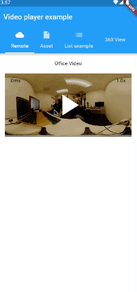
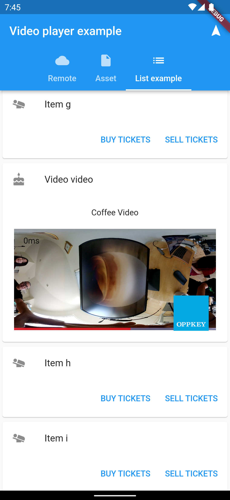
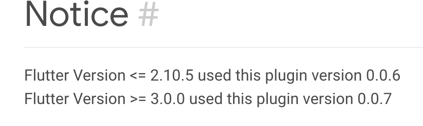

# Video Player Project 1

This project displays videos from the network and asset folder using the [video_player](https://pub.dev/packages/video_player) Flutter plugin. It modifies the [example](https://pub.dev/packages/video_player/example) from `video_player`. 

## Teaching Objects

Students following our tutorials will learn:

* RICOH THETA video files are standard MP4 video files in a 2:1 aspect ratio and can be viewed with standard mobile app viewers
* 360 navigation will require a special 360 viewer

## Network Video

The application gets a video from a network URL using a github page. Below is an example of displaying a network video:



The package uses a `VideoPlayerController` to display the network video.

```dart
void initState() {
    super.initState();
    _controller = VideoPlayerController.network(
      'https://codetricity.github.io/flutter_video_display/ageda.MP4',
      closedCaptionFile: _loadCaptions(),
      videoPlayerOptions: VideoPlayerOptions(mixWithOthers: true),
    );
```

## Asset Video

This example also gets video from the assets/ folder. Here is a part of a code for displaying the local video.

```dart
  @override
  void initState() {
    super.initState();
    _controller = VideoPlayerController.asset(file);

    _controller.addListener(() {
      setState(() {});
    });
    _controller.setLooping(true);
    _controller.initialize().then((_) => setState(() {}));
    _controller.play();
  }

```

## ListView

Using the `video_player` package, a `ListView` of videos can be created. 



## 360 View

The application uses the [video_360](https://pub.dev/packages/video_360) package to show videos in 360 view. 


## Problems
* Currently, List View crashes when adding multiple videos
* Project crashes if video360 version is not changed in `pubspec.yaml`.

* When adding video360 to the project, received this error: `Cannot fit requested classes in a single dex file`. To solve the error, add `androidx.multidex:multidex:2.0.1 ` to the `build.gradle` file. Also, add `multiDexEnabled true`. 

```dart
  defaultConfig {
    ...
        multiDexEnabled true
    }

dependencies {
    ...
    implementation 'androidx.multidex:multidex:2.0.1'
}

```