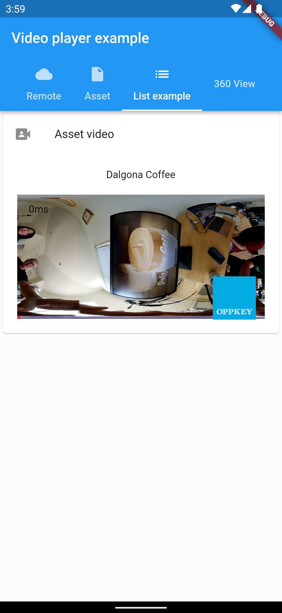

# Video Player Project

An example using the video from assets folder:


This project displays video from the network and asset folder. Below is an example of the network video.

```dart
void initState() {
    super.initState();
    _controller = VideoPlayerController.network(
      'https://codetricity.github.io/flutter_video_display/ageda.MP4',
      closedCaptionFile: _loadCaptions(),
      videoPlayerOptions: VideoPlayerOptions(mixWithOthers: true),
    );
```

List view example:

